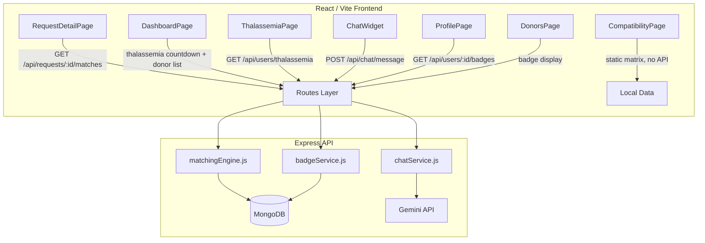

# Design Document: AI Donor Matching Feature Set

## Overview

This document describes the technical design for five features added to the **Little Hearts** blood bank platform: Smart Donor Matching Score, Thalassemia Patient Mode, Donor Engagement & Badges System, Blood Compatibility Chart, and an AI Chat Assistant. All features integrate with the existing MERN stack (React 18 + Vite, Express, MongoDB), JWT auth system, and macOS/iOS design language.

The design prioritises backward compatibility — existing User, BloodRequest, Donation, and ActivityLog models are extended with new optional fields rather than replaced. New routes are added alongside existing ones. No existing API contracts are broken.

---

## Architecture



The matching engine and badge service are pure server-side utility modules. The chat service wraps the Gemini API. The compatibility chart is entirely client-side with no API dependency — the compatibility matrix is a static data file.

---

## Components and Interfaces

### New Backend Routes

| Method | Path | Auth | Description |
|--------|------|------|-------------|
| GET | `/api/requests/:id/matches` | Required | Returns top-10 ranked donors for a blood request |
| PUT | `/api/auth/profile/transfusion-schedule` | Required (thalassemia role) | Update transfusion schedule |
| GET | `/api/users/thalassemia` | Required | List all thalassemia patients |
| GET | `/api/users/:id/badges` | None | Return badges, Karma_Score, streak for a user |
| POST | `/api/chat/message` | Required | Forward message to Gemini API, return response |

### New Frontend Pages and Components

| Component | Path | Description |
|-----------|------|-------------|
| `CompatibilityPage` | `/compatibility` | Full-page 8×8 interactive matrix + educational content |
| `ThalassemiaPage` | `/thalassemia` | List of thalassemia patients with next transfusion dates |
| `ChatWidget` | Global (App.jsx) | Floating bottom-right chat button and panel |
| `MatchedDonorsSection` | Inside `RequestDetailPage` | Ranked donor list with scores |
| `AchievementsSection` | Inside `DashboardPage` | Badges, Karma_Score, streak, next milestone |
| `BadgeDisplay` | Reusable UI component | Renders a single badge pill |

### Server-Side Utility Modules

**`server/services/matchingEngine.js`**
```
computeMatchScore(donor, request) → number (0–100)
getMatchesForRequest(requestId, viewerId) → MatchResult[]
```

**`server/services/badgeService.js`**
```
checkAndAwardBadges(userId) → Badge[]   // called after each donation
computeKarmaScore(totalDonations, streak) → number (0–500)
updateStreak(userId, donationDate) → number
```

**`server/services/chatService.js`**
```
sendMessage(message, history) → string  // calls Gemini API
buildSystemPrompt() → string
```

---

## Data Models

### User Model — Extended Fields

The existing `User` schema gains the following optional fields. All are optional so existing documents remain valid without migration.

```javascript
// Thalassemia Patient Mode
transfusionSchedule: {
  nextTransfusionDate: { type: Date },
  frequencyWeeks:      { type: Number, min: 2, max: 4 },
  requiredBloodType:   { type: String, enum: ['A+','A-','B+','B-','AB+','AB-','O+','O-'] }
},

// Donor Engagement & Badges
badges: [{
  name:      { type: String, enum: ['First Drop', 'Regular Hero', 'Lifesaver', 'Legend'] },
  awardedAt: { type: Date, default: Date.now }
}],
donationStreak:  { type: Number, default: 0 },
karmaScore:      { type: Number, default: 0 },
lastDonationMonth: { type: String }, // stored as "YYYY-MM" for streak tracking

// Role extension (add 'thalassemia' to existing enum)
role: {
  type: String,
  enum: ['donor', 'recipient', 'both', 'admin', 'thalassemia'],
  default: 'donor'
}
```

**Badge milestone thresholds:**

| Badge | Threshold (`totalDonations`) | Tier |
|-------|------------------------------|------|
| First Drop | 1 | 1 |
| Regular Hero | 5 | 2 |
| Lifesaver | 10 | 3 |
| Legend | 25 | 4 |

### No New Collections Required

All new data is embedded in the User document. The chat session history is stored in React state (sessionStorage for persistence across soft navigations) — it is not persisted to the database.

---

## Correctness Properties

*A property is a characteristic or behavior that should hold true across all valid executions of a system — essentially, a formal statement about what the system should do. Properties serve as the bridge between human-readable specifications and machine-verifiable correctness guarantees.*

### Property 1: Match results contain only compatible blood types

*For any* blood request with a given required blood type, every donor returned by the matching engine SHALL have a blood type that is compatible with the request's required type according to the Compatibility_Matrix.

**Validates: Requirements 1.1**

---

### Property 2: Match score is a bounded weighted sum

*For any* donor and blood request, the computed Match_Score SHALL equal the sum of all applicable component weights (blood type compatibility: 0 or 20 or 40; city match: 0 or 25; availability: 0 or 20; 60-day gap: 0 or 10; donation count: 0–5), and the result SHALL always be in the range [0, 100].

**Validates: Requirements 1.2**

---

### Property 3: Match results are sorted descending and capped at 10

*For any* set of scored donors, the list returned by the matching engine SHALL be sorted in descending order of Match_Score and SHALL contain at most 10 entries.

**Validates: Requirements 1.3, 2.6**

---

### Property 4: Transfusion schedule frequency is validated

*For any* transfusion schedule update, the system SHALL accept frequency values in the range [2, 4] weeks and SHALL reject values outside that range with a validation error.

**Validates: Requirements 2.3**

---

### Property 5: Transfusion countdown is accurate

*For any* future next transfusion date, the countdown displayed SHALL equal the ceiling of `(nextTransfusionDate - currentDate)` in whole days, and SHALL be non-negative.

**Validates: Requirements 2.4**

---

### Property 6: Auto-advance produces a future date

*For any* past next transfusion date and any valid frequency (2–4 weeks), the auto-advanced date SHALL equal `pastDate + (frequencyWeeks × 7 days)` and SHALL be strictly after the current date.

**Validates: Requirements 2.8**

---

### Property 7: Badge award is monotonic and threshold-correct

*For any* sequence of donation events that brings `totalDonations` to value N, the set of badges on the donor's profile SHALL contain exactly the badges whose thresholds are ≤ N, and each badge SHALL appear at most once.

**Validates: Requirements 3.1, 3.2**

---

### Property 8: Karma_Score formula is bounded

*For any* non-negative `totalDonations` value D and non-negative `donationStreak` value S, the computed Karma_Score SHALL equal `min(500, (D × 10) + (S × 5))`.

**Validates: Requirements 3.3**

---

### Property 9: Streak tracking is correct across donation sequences

*For any* sequence of donation dates: if consecutive donations fall in consecutive calendar months, the streak SHALL increment by 1 for each consecutive month; if a calendar month is skipped between any two donations, the streak SHALL reset to 0 before counting the new donation.

**Validates: Requirements 3.4, 3.5**

---

### Property 10: Donor card badge display shows top-tier badges only

*For any* donor with an arbitrary set of earned badges, the donor card SHALL display at most 3 badges, and the displayed badges SHALL be the highest-tier ones (by milestone tier order: Legend > Lifesaver > Regular Hero > First Drop).

**Validates: Requirements 3.7**

---

### Property 11: Compatibility matrix highlight is exact

*For any* selected blood type B, the set of cells highlighted in the compatibility matrix SHALL exactly match the set of (donor, recipient) pairs where the donor type can donate to the recipient type according to the ABO/Rh Compatibility_Matrix — no more, no fewer.

**Validates: Requirements 4.3**

---

### Property 12: URL query param pre-selects the correct blood type

*For any* valid blood type value passed as the `?highlight=` query parameter, the compatibility page SHALL pre-select exactly that blood type in the matrix on initial render.

**Validates: Requirements 4.8**

---

### Property 13: Chat session history grows monotonically

*For any* sequence of N messages sent within a single browser session, the chat history array SHALL contain exactly N entries in the order they were sent, with no entries dropped or reordered.

**Validates: Requirements 5.10**

---

## Error Handling

### Matching Engine
- If the request ID does not exist: return `404 { message: 'Request not found' }`.
- If the request status is `fulfilled` or `cancelled`: return `200 { matches: [], message: 'Matching not available for closed requests' }`.
- If no compatible donors exist: return `200 { matches: [] }` — the UI renders the empty state message.
- Database errors: return `500 { message: 'Internal server error' }` — never expose stack traces.

### Transfusion Schedule
- If `frequencyWeeks` is outside [2, 4]: return `400 { message: 'Frequency must be between 2 and 4 weeks' }`.
- If `requiredBloodType` is not a valid enum value: return `400 { message: 'Invalid blood type' }`.
- If the user's role is not `thalassemia`: return `403 { message: 'Only thalassemia patients can set a transfusion schedule' }`.

### Badge Service
- Badge award failures are non-fatal: log the error to the ActivityLog but do not fail the donation creation response.
- Karma_Score and streak are recomputed on each donation write — if the recomputation fails, the donation is still saved and the score is corrected on the next successful write.

### Chat Assistant
- No `GEMINI_API_KEY` in environment: return `200 { response: 'The AI assistant is currently unavailable. Please use the Compatibility Chart or contact a donor directly.' }` — do not return a 5xx.
- Gemini API HTTP error: return `200 { response: 'Something went wrong. Please try again.' }` — never forward raw API error details to the client.
- Message body missing or empty: return `400 { message: 'Message is required' }`.
- Message exceeds 1000 characters: return `400 { message: 'Message too long' }` to prevent prompt injection via oversized inputs.

### Compatibility Chart
- The chart is fully static — no API calls, no error states beyond standard React rendering.
- Invalid `?highlight=` query param values (not a valid blood type) are silently ignored; no blood type is pre-selected.

---

## Testing Strategy

### Unit Tests (Example-Based)

Use **Vitest** on the client and **Jest** on the server. Focus on:

- `matchingEngine.js`: specific score calculations for known donor/request combinations, empty donor set, all-zero score donor.
- `badgeService.js`: each milestone threshold boundary (e.g., donations = 4 → no badge, donations = 5 → Regular Hero awarded).
- `chatService.js`: system prompt content verification, fallback message when API key absent.
- `CompatibilityPage`: renders 8×8 grid, educational section present, navbar link visible to unauthenticated users.
- `ChatWidget`: starter questions shown on empty history, disclaimer visible when panel open, fallback message displayed when API unavailable.
- `RequestDetailPage`: matched donors section hidden for fulfilled/cancelled requests, "Request to Connect" shown when phone is hidden.

### Property-Based Tests

Use **fast-check** (JavaScript) for both client and server property tests. Each test runs a minimum of **100 iterations**.

Tag format: `// Feature: ai-donor-matching, Property N: <property_text>`

**Server-side property tests** (`server/__tests__/properties/`):

```
matchingEngine.property.test.js
  - Property 1: all returned donors have compatible blood types
  - Property 2: score is bounded weighted sum in [0, 100]
  - Property 3: results sorted descending, length ≤ 10

badgeService.property.test.js
  - Property 7: badge set is monotonic and threshold-correct
  - Property 8: karma score = min(500, D×10 + S×5)
  - Property 9: streak increments on consecutive months, resets on gap

transfusionSchedule.property.test.js
  - Property 4: frequency validated in [2, 4]
  - Property 5: countdown = ceil((nextDate - now) / msPerDay)
  - Property 6: auto-advance produces future date
```

**Client-side property tests** (`client/src/__tests__/properties/`):

```
compatibilityMatrix.property.test.js
  - Property 11: highlighted cells exactly match compatibility matrix
  - Property 12: ?highlight= query param pre-selects correct blood type

donorCard.property.test.js
  - Property 10: badge display shows top-3 highest-tier badges

chatHistory.property.test.js
  - Property 13: session history grows monotonically
```

### Integration Tests

- `GET /api/requests/:id/matches`: authenticated request returns ranked list; unauthenticated returns 401.
- `PUT /api/auth/profile/transfusion-schedule`: valid schedule saves; non-thalassemia user gets 403.
- `POST /api/chat/message`: with mocked Gemini API returns response; without API key returns fallback.
- `GET /api/users/:id/badges`: returns badge data without auth token.
- Auto-advance cron: simulate a thalassemia user with a past `nextTransfusionDate`; verify the date is advanced on the next scheduled run.

### Compatibility Matrix Data

The static compatibility matrix is defined in `client/src/data/compatibilityMatrix.js`:

```javascript
// compatibilityMatrix[donorType][recipientType] = true | false
export const COMPATIBILITY_MATRIX = {
  'O-':  { 'O-': true,  'O+': true,  'A-': true,  'A+': true,  'B-': true,  'B+': true,  'AB-': true, 'AB+': true  },
  'O+':  { 'O-': false, 'O+': true,  'A-': false, 'A+': true,  'B-': false, 'B+': true,  'AB-': false,'AB+': true  },
  'A-':  { 'O-': false, 'O+': false, 'A-': true,  'A+': true,  'B-': false, 'B+': false, 'AB-': true, 'AB+': true  },
  'A+':  { 'O-': false, 'O+': false, 'A-': false, 'A+': true,  'B-': false, 'B+': false, 'AB-': false,'AB+': true  },
  'B-':  { 'O-': false, 'O+': false, 'A-': false, 'A+': false, 'B-': true,  'B+': true,  'AB-': true, 'AB+': true  },
  'B+':  { 'O-': false, 'O+': false, 'A-': false, 'A+': false, 'B-': false, 'B+': true,  'AB-': false,'AB+': true  },
  'AB-': { 'O-': false, 'O+': false, 'A-': false, 'A+': false, 'B-': false, 'B+': false, 'AB-': true, 'AB+': true  },
  'AB+': { 'O-': false, 'O+': false, 'A-': false, 'A+': false, 'B-': false, 'B+': false, 'AB-': false,'AB+': true  },
};

export const BLOOD_TYPES = ['O-','O+','A-','A+','B-','B+','AB-','AB+'];
```

This file is the single source of truth for compatibility logic — both the matching engine (imported server-side via a shared utility or duplicated) and the compatibility chart use it.
